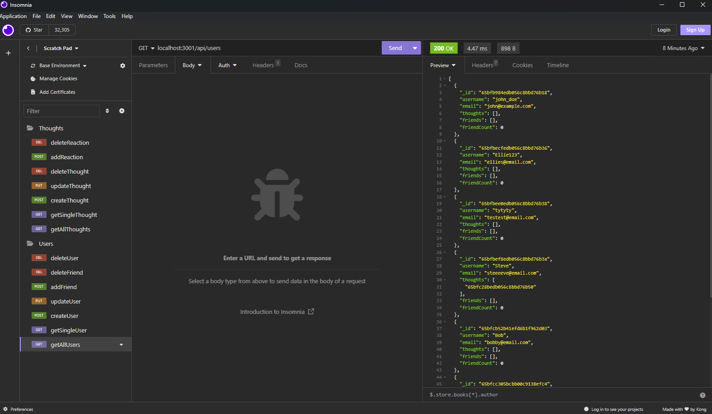
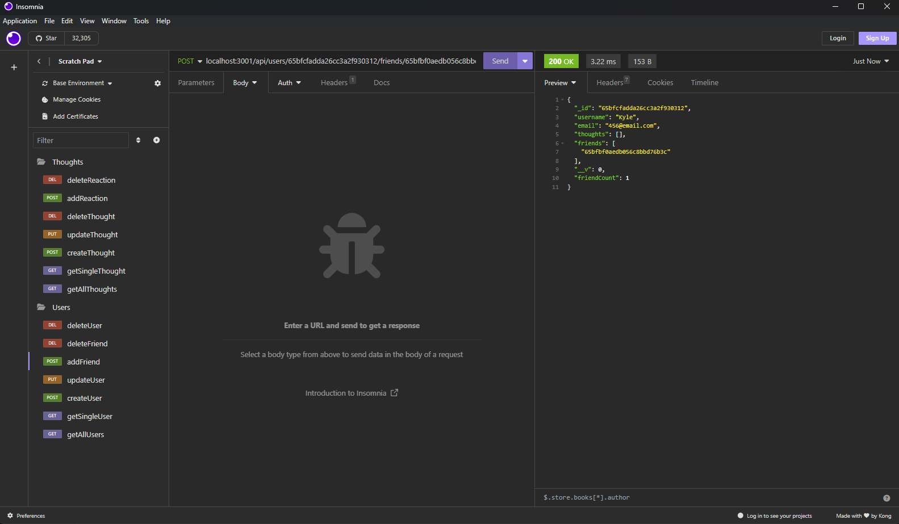
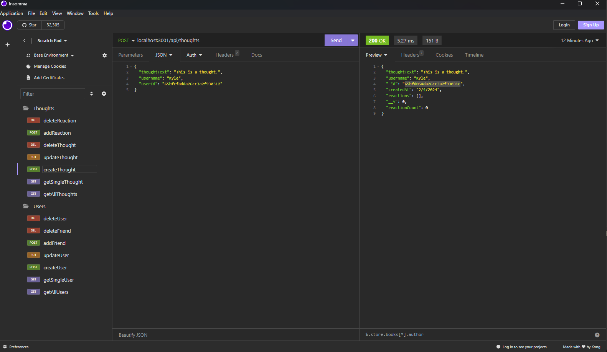

# SocialNetworkAPI

# Description

The purpose of this project was to build an API for a social network application. The API should allow users to share thoughts, update their existing thoughts, delete thoughts, add/delete friends, react to other's thoughts, and delete reactions. Bonus was added for functionality to delete user and associated thoughts. I needed to use Express.js for routing, MongoDB database, and Mongoose ODM. Walkthrough video provided as this app did not require deployment.

# Installation

Ensure dependencies are installed by running 'npm i' in the terminal. Then run 'node server.js' in order to start the server. Functionality tested via Insomnia. 

[Link to Walkthrough Video](https://drive.google.com/file/d/1TJs-OAorwe8igbfqPovSkKFFGhdZryqx/view)
